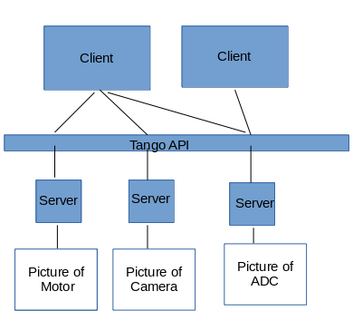

.. _quick-tour:

Quick tour
==========

What is Tango
-------------
TANGO Controls is a scalable, object oriented software toolkit for connecting hardware and software together.
The hardware can be on the same computer or distributed over a number of computers interconnected on a network.

It is a mature and stable piece of software which is used by many sites from small institutes to large complexes that
run highly complicated accelerators where experiments run 24 hours a day, seven days a week.
It is free, Open Source and provides full support for 3 programming languages - C++, Python and Java
It is ideal for small and large installations.
It provides full support for 3 programming languages - C++, Python and Java

Who uses Tango
--------------
The TANGO Controls community is a consortium of institutes and industrial partners headed by an executive Steering Committee.
The Steering Committee makes strategic decisions about core developments in the TANGO collaboration.
There is one representative from each institute who has signed the Tango Controls Collaboration Contract.
The representative is a person who has the highest ranking in the institutes’s hierarchy and has sufficient technical knowledge about TANGO. 
The steering committee also decides upon the allocation of resources for developing software for Tango.
To ensure that the right decisions are made and match those of the user community, advice is sought by the committee from their respective users and developers on a regular basis.

There are 2 types of members of the  TANGO Controls Steering Committee Members:

    * Core members who contribute financially to the maintenance of TANGO and who commit at least 6 months of an engineer annually to develop and commit source to the TANGO Controls core projects or

    * Contributing members who contribute to the financing of the maintenance of TANGO.

Both members normally use TANGO and write and share TANGO device classes with the community.

When was it developed
---------------------
TANGO development started at the ESRF in 1999 as a successor to TACO but was joined in 2000 by the controls team from the Soleil Synchrotron.
The two institutes co-developed the first versions of TANGO and were then joined by Elettra, ALBA, and DESY.
Since then the community has grown quickly and today counts 39 sites.

Where is it deployed
--------------------

    * ESRF
    * SOLEIL
    * ALBA
    * ANKA
    * DESY
    * ELETTRA
    * FRM-II
    * MAX-IV
    * SOLARIS

    * ELI BEAMS
    * ELI-ALPS
    * ELI-NP
    * SKA

    * AKKA
    * ATOS WORLDGRID
    * BERTIN TECHNOLOGIES
    * CODRA
    * 3Controls
    * COSYLAB
    * Ecole Polytechnique
    * HYTEC ELECTRONICS Ltd
    * INAF
    * INSTRUMENTATION TECHNOLOGIES d.d. 
    * JINR
    * Kurchatov Institute
    * LAL
    * Nangenex
    * NEXEYA SYSTEMS
    * OBSERVATORY SCIENCES Ltd
    * Onera
    * SCANDINOVA
    * SOFTWARESCHNEIDEREI GmbH
    * TATA consultancy Services
    * THALES Optronic
    * THALES Service
    * THEOSIS SAS
    * University of Szeged
    * Webu

Why choose Tango
----------------
TANGO is a mature and highly reliable product. It provides very fast communication between clients and hardware devices.
These devices can be on the same computer or distributed over a number of computers interconnected on a network.
Programming support is available for both clients and servers written in C++, Java or Python.
Bindings for commonly used commercial software are also available.

TANGO is capable of controlling very big installations containing more than 150000 channels of information, such as ESRF synchrotron,as well as small laboratories.
TANGO provides a kernel API which hides all the details of network access and provides object browsing, discovery and security features.

TANGO comes with ready to use graphical applications that allow you to graphically control and display data coming from your device(s). 

Tango Fundamentals
------------------

Before you begin there are some fundamental TANGO concepts that you should be aware of.

TANGO consists basically of a set of **devices** running somewhere on the network.

A device is identified by a unique case insensitive name in the format 
*<domain>/<family>/<member>*. Example:  `ID21/OpticsHutch/energy`. 

Each device has a series of *attributes*, *properties* and *commands*. 

An attribute is identified by a name in a device. It has a value that can 
be read. Some attributes can also be changed (read-write attributes).

A property is identified by a name in a device. Usually, devices properties are
used to provide a way to configure a device. 

A command is also identified by a name. A command may or not receive a parameter
and may or not return a value when it is executed.

A device implementation requires  **at least** a *State* and *Status* attributes and *State*,
*Status* and *Init* commands. Reading the *State* or *Status* attributes has 
the same effect as executing the *State* or *Status* commands.

Each device as an associated *TANGO Class*. Most of the time the TANGO class 
has the same name as the object oriented programming class which implements it
but that is not mandatory. 

TANGO devices *live* inside a operating system process called *TANGO Device Server*.
This server acts as a container of devices. A device server can host multiple
devices of multiple TANGO classes. Devices are, therefore, only accessible when
the corresponding TANGO Device Server is running.

A special TANGO device server called the *TANGO Database Server* will act as
a naming service between TANGO servers and clients. This server has a known 
address where it can be reached. The machines that run TANGO Device Servers 
and/or TANGO clients, should export an environment variable called
:envvar:`TANGO_HOST` that points to the TANGO Database server address. Example:
``TANGO_HOST=homer.lab.eu:10000``

